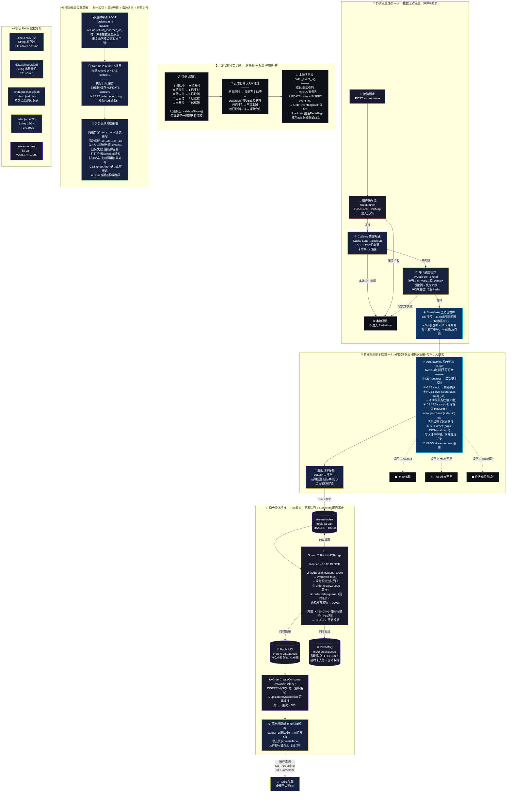

# 星席校内活动票务履约系统

---

## 架构分层总结

| 层级 | 职责 | 关键技术 | 失败处理 |
|------|------|---------|---------|
| **多级流量过滤** | 入口拦截无效流量 | RateLimiter + Caffeine售罄 + 单飞锁 | 售罄即短路，锁竞争失败快速返回 |
| **多维限购原子校验** | 无锁化校验+扣减+写单 | Lua原子脚本(7操作/12µs) | 售罄-1/库存-2/限购-3 分层返回 |
| **异步投递桥接** | 可靠落库，双队列投递 | Stream + 阻塞队列 + RabbitMQ双队列 + PEL | 延时队列兜底取消 + 订单号幂等 |
| **并发状态冲突治理** | 支付回调vs关单碰撞 | 状态机+乐观锁+查单对齐 | 逆向退款兜底 |
| **退款单表幂等** | 防重复退款+异步兜底 | 唯一索引+指数退避+告警 | 重试5次→阻断告警 |
