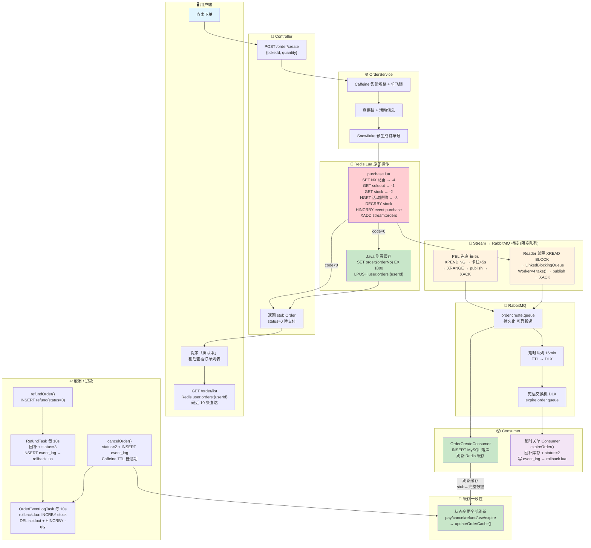
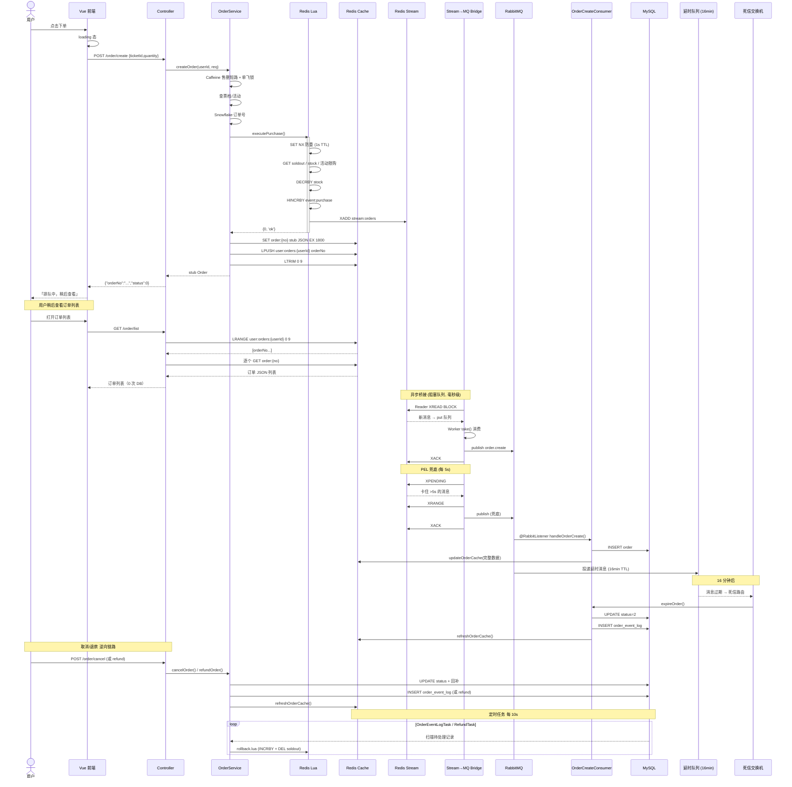

# 抢购链路架构图（v4.3）

## 时序详解

## Redis Key 索引

| Key | 类型 | TTL | 说明 |
|-----|------|-----|------|
| `dedup:order:{userId}:{ticketId}` | String | 1s | 防重提交键，Lua SET NX |
| `ticket:stock:{id}` | String | saleEndTime | 票档库存，Lua DECRBY |
| `ticket:soldout:{id}` | String | 5min | 售罄标记 |
| `event:purchase:{id}` | Hash | — | 活动限购，userId→qty |
| `stream:orders` | Stream | MAXLEN~10000 | 订单事件流 |
| `order:{orderNo}` | String | 30min | 订单 JSON 缓存 |
| `user:orders:{userId}` | List | 30min | 最近 10 条订单号 |
